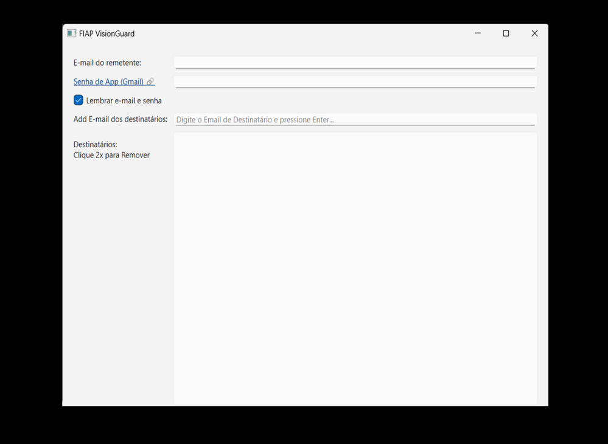
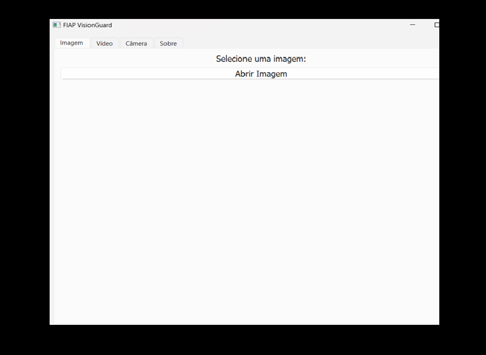
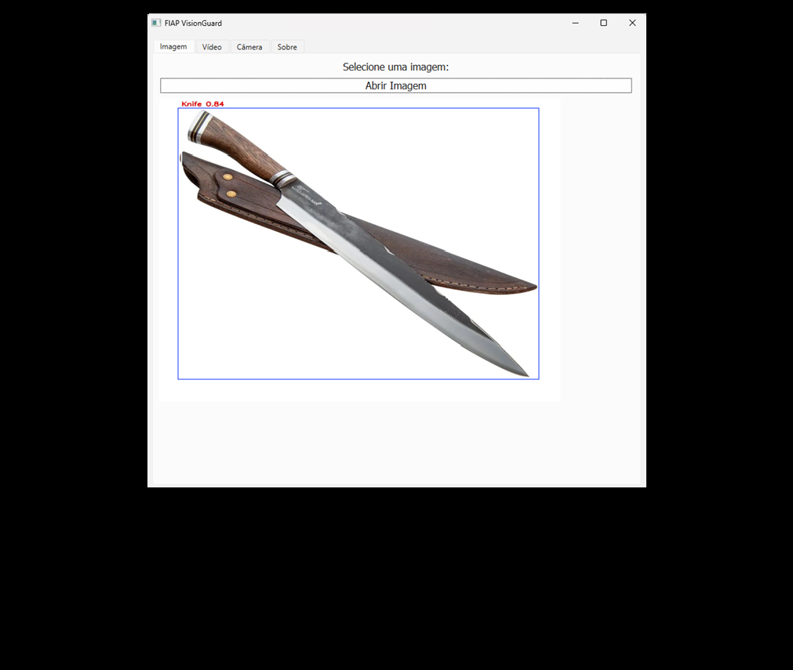
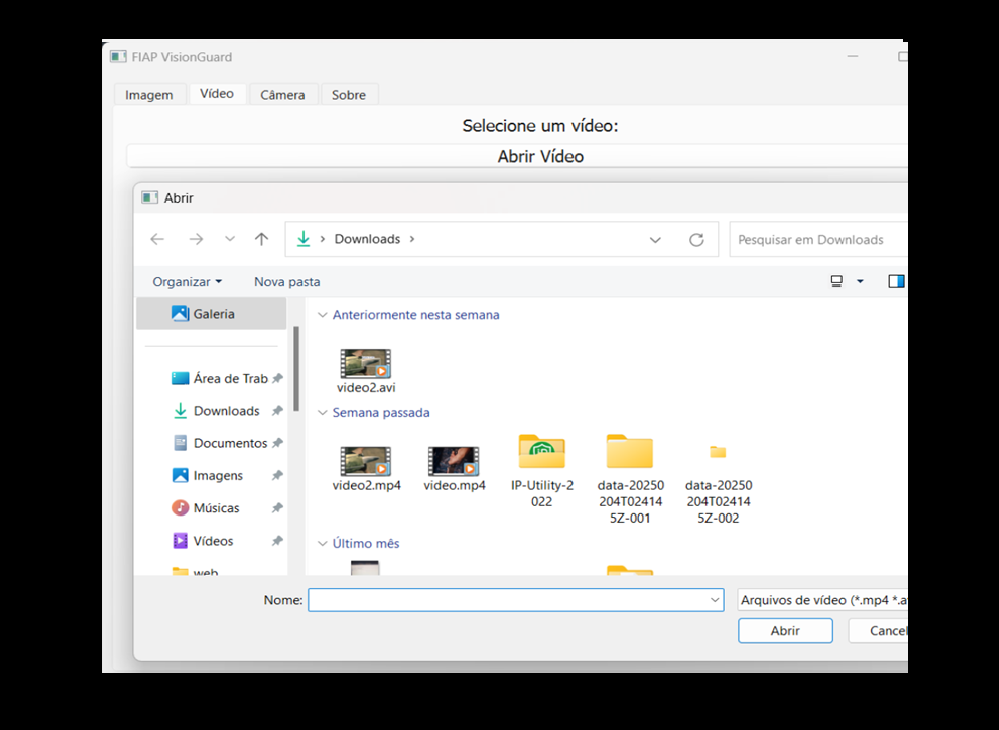
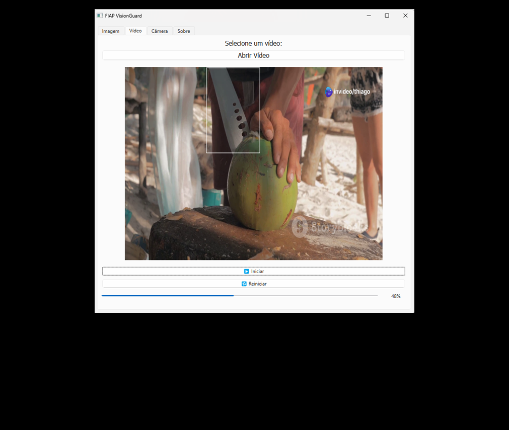
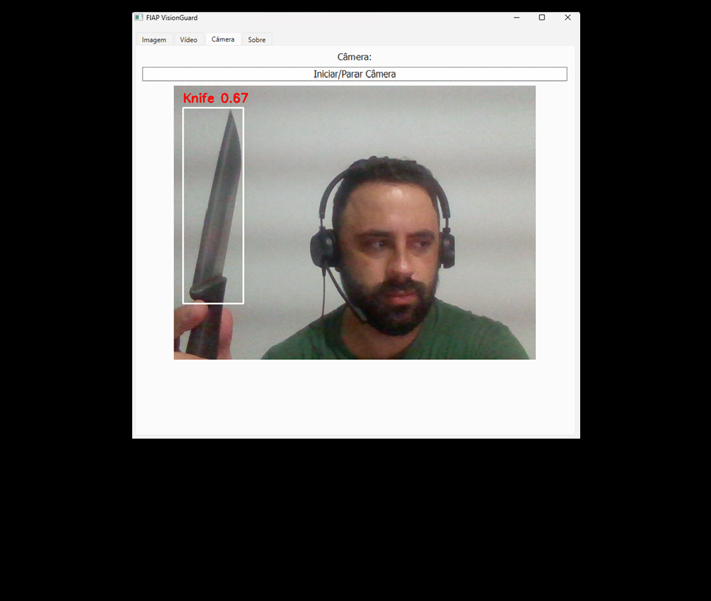

# Hackathon FIAP IADT - Grupo 6

Esse repositório contém a solução para o desafio proposto na fase final do curso IA para Devs da FIAP.

## Desafio: FIAP VisionGuard

A FIAP VisionGuard, empresa de monitoramento de câmeras de segurança, está analisando a viabilidade de uma nova funcionalidade para otimizar o seu software.
O objetivo da empresa é usar de novas tecnologias para identificar situações atípicas e que possam colocar em risco a segurança de estabelecimentos e comércios que utilizam suas câmeras.

Um dos principais desafios da empresa é utilizar Inteligência Artificial para identificar objetos cortantes (facas, tesouras e similares) e emitir alertas para a central de segurança.

A empresa tem o objetivo de validar a viabilidade dessa feature, e para isso, será necessário fazer um MVP para detecção supervisionada desses objetos.

Objetivos
 * Construir ou buscar um dataset contendo imagens de facas, tesouras e outros objetos cortantes em diferentes condições de ângulo e iluminação;
 * Anotar o dataset para treinar o modelo supervisionado, incluindo imagens negativas (sem objetos perigosos) para reduzir falsos positivos;
 * Treinar o modelo;
 * Desenvolver um sistema de alertas (pode ser um e-mail).

## Solução

O código desse repositório está dividido em duas partes:

1. Treinamento do modelo para detecção de armas, facas, pistolas. Se quiser reproduzir o treinamento, siga os passos nesse [Link](model_training/README.md).

2. Aplicação que utiliza o modelo treinado para deteção de armas, facas e pistolas.

Essa aplicação, por utilizar um modelo de detecção, necessita de uma GPU para ser executada de forma performática. É possível executar somente com CPU, mas o processamento será lento.

Caso queira rodar utilizando CUDA, siga a documentação nesse [link](https://pytorch.org/get-started/locally/) para instalar o pytorch na versão correta: 

## Como executar:

Para executar a aplicação, siga os passos abaixo:

1. Instalar dependências

> pip install -r requirements.txt

2. Executar Aplicação:

> python src/main.py

Ao executar a aplicação, alguns passos são necessários para configurar a aplicação para que ela execute corretamente:

#### Download do modelo

Por conta do tamanho do arquivo, o modelo treinado não está versionado nesse repositório. A aplicação, ao ser executada, irá verificar se o modelo já foi baixado. Caso não, o modelo será baixado automaticamente a partir do google drive. **Não é necessário nenhuma ação**. 

O modelo será salvo em: `src/resources/model/model.pt`

Caso exista a necessidade de baixar manualmente o modelo, ele está disponível nesse [Link](https://drive.google.com/uc?id=1-eiFluZMyC33URgVPVAJSlB1_sWaUQVD) 

#### Configurar email

A aplicação envia emails notificando o usuário sempre que uma arma for detectada. Para isso é necessário configurar o email para qual os alertas serão enviados, assim que a aplicação é executada.

A seguinte tela será exibida:

Nessa tela é necessário informar pelo menos um email ( pode ser mais de um) de destinatário.

Ao validar e continuar, a aplicação irá validar os endereços de email e, em caso de sucesso, a aplicação será carregada.

#### Detecção

A detecção de armas, facas e etc pode ser feita em diversas fontes como:

- Arquivo de Imagem

1. Clique em `Abrir Imagem`
2. Selecione a imagem para validação de armas
3. Aguarde o processamento da imagem. Após o processamento, a detecção será exibida como na imagem abaixo

- Arquivo de Vídeo

1. Clique em `Abrir Vídeo`
2. Selecione o vídeo para validação de armas
3. Aguarde o processamento do vídeo. Após o processamento, a detecção será exibida como na imagem abaixo:

- Webcam

1. Clique em `Iniciar / Parar Câmera`
2. Se necessário, libere as permissões
3. A detecção será exibida como na imagem abaixo:

Para cada um dos itens acima, caso alguma faca, pistola ou arma longa seja detectada, um email será enviado para o(s) destinatário(s) configurados na tela inicial.